# DVC tracked files schema

```mermaid
flowchart TD
	node1["data/metrics/s0.3_metrics.yaml"]
	node2["data/metrics/s0.3_protein_per_data_distr.csv"]
	node3["data/metrics/s1.0_metrics.yaml"]
	node4["data/metrics/s1.1_metrics.yaml"]
	node5["data/metrics/s1.2_metrics.yaml"]
	node6["data/metrics/s1.3_metrics.yaml"]
	node7["data/metrics/t0.2_total_search_space.csv"]
	node8["data/metrics/t1.0_chosen_protein_search_space.yaml"]
	node9["data/metrics/t1.2_metrics.yaml"]
	node10["data/plots/cumsum_proteins.png"]
	node11["data/plots/ogt_hist.png"]
	node12["data/plots/protein_per_taxa_hist.png"]
	node13["data/plots/search_space_resource_test.png"]
	node14["data/plots/total_search_space.png"]
	node15["data/protein_pairs"]
	node16["data/proteins"]
	node17["data/taxa.parquet"]
	node18["data/taxa_pairs/alignment"]
	node19["data/taxa_pairs/pair_labels"]
	node20["data/taxa_thermophile_labels.parquet"]
	node21["data/uniprot/proteome_metadata.csv"]
	node22["data/uniprot/uniprot_pulled_timestamp"]
	node2-->node4
	node2-->node7
	node2-->node8
	node2-->node10
	node2-->node12
	node2-->node13
	node2-->node14
	node2-->node18
	node16-->node6
	node16-->node8
	node16-->node9
	node16-->node12
	node16-->node13
	node16-->node15
	node17-->node1
	node17-->node2
	node17-->node3
	node17-->node4
	node17-->node7
	node17-->node10
	node17-->node11
	node17-->node14
	node17-->node16
	node17-->node18
	node17-->node20
	node18-->node5
	node18-->node6
	node18-->node9
	node18-->node15
	node18-->node19
	node19-->node6
	node19-->node9
	node19-->node15
	node20-->node4
	node20-->node8
	node20-->node12
	node20-->node13
	node20-->node18
	node21-->node1
	node21-->node2
	node21-->node16
	node22-->node1
	node22-->node2
	node22-->node16
	node23["data/metrics/s0.0_metrics.yaml"]
	node24["data/metrics/s0.1_metrics.yaml"]
```

## Metrics and plots:
- `data/metrics/s0.0_metrics.yaml`: Number of organisms with both OGT and 16s, date of taxa download
- `data/plots/ogt_hist.png`: histogram of taxa OGTs
- `data/metrics/s0.1_metrics.yaml`: Date of uniprot download
- `data/metrics/s0.3_metrics.yaml`: Number of proteins, fraction with PDB or AlphaFold, carbon cost of script
- `data/metrics/s0.3_protein_per_data_distr.csv`, `data/plots/protein_per_taxa_hist.png`: table and associated plot mapping number of uniprot proteins to species taxid
  - "taxid": ncbi species id
  - "count_star()": number of proteins per organism
- `data/metrics/t0.2_total_search_space.csv`, `data/plots/total_search_space.png`: data and associated plot for the total possible number of protein pairs to search for as thermophile/mesophile temperature and window changes
- `data/plots/cumsum_proteins.png`: plot of total number of proteins as proteins per organism increases
- `data/metrics/s1.0_metrics.yaml`: Number of thermophiles and mesophiles for chosen OGT binary threshold
- `data/metrics/t1.0_chosen_protein_search_space.yaml`: total possible protein pairs among all thermophilic vs all mesophilic proteins
- `data/plots/search_space_resource_test.png`: compares BLAST and DIAMOND in therms of time, hits, carbon, and RAM if we were to search for protein pairs among all thermophilic vs all mesophilic proteins
- `data/metrics/s1.1_metrics.yaml`: Fraction of total pairwise taxa alignment that were hit, and carbon cost of 16s alignment
- `data/metrics/s1.2_metrics.yaml`: number of taxa pairs identified from 16s alignment and fraction if the total possible that is
- `data/metrics/t1.2_metrics.yaml`:emissions, total pairs, time requirement, and fraction of total possible that we would get back from protein alignment based on a resource test
- `data/metrics/s1.3_metrics.yaml`: emissions, total pairs, time requirement, and fraction of total possible that we got back from protein alignment

## Data files:
- `data/taxa.parquet`: Table of organisms with taxid, 16s sequence and OGT
  - "taxid": ncbi taxonomy id of species
  - "16s_seq": nucleotide sequence of 16s rRNA
  - "16s_len": length of 16s sequence
  - "temperature": OGT label
  - "superkingdom", "phylum", "class", "order", "family", "genus": taxonomy information
- `data/uniprot/uniprot_pulled_timestamp`: In lieu of DVC tracking the uniprot zipped files (>1000 GB), simply tracks when uniprot was pulled
- `data/uniprot/proteome_metadata.csv`: Data table of proteomes in uniprot, ID, number of proteins, quality label (eg. representative, redundant, excluded, etc.). See uniprot docs for some fields: https://www.uniprot.org/help/proteome
  - "pid": uniprot proteome id
  - "species_taxid": ncbi taxid of species level for proteome
  - "strain_taxid": ncbi taxid of strian level for proteome
  - "qualifier": eg. 'redundant' or 'representative'
  - "completeness": statistical measure of how complete the proteome is compared to other proteomes of the strain
  - "num_proteins": count of proteins in proteome
- `data/proteins`: Contains many parquet files of proteins in chunks.
  - "pid": UPKB protein id
  - "taxid": ncbi species id of protein
  - "pdb_id": PDB databse identifier if present
  - "alphafold_id": AlphaFoldDB 
  - "proteome": UP proteome id
  - "protein_seq": amino acid sequences of proteins
- `data/taxa_thermophile_labels.parquet`: bolean labels of if thermophile or mesophile
  - "taxid": NCBI species id
  - "thermophile_label": boolean, True if thermophile
- `data/taxa_pairs/alignment`: Contains parquet files of taxa 16s alignment in chunks.
  - "query_id": ncbi taxid of thermophile
  - "subject_id": ncbi taxid of mesophile
  - "X": where X is some metric extracted from the alignments
- `data/taxa_pairs/pair_labels`: Contains parquet files of organism pair labels, indexes map 1:1 to `data/taxa_pairs/alignment`
  - "is_pair": boolean if metric thresholds were met and organism pair should be considered a pair for protein alignment
- `data/protein_pairs`: Contains many parquet files of the form `align_taxa_XX-YY.parquet` where XX is thermophile taxid and YY is mesophile taxid
  - "thermo_pid": UPKB protein ID for the thermophilic protein
  - "meso_pid": UPKB protein ID for the mesophilic protein
  - "X": where X is metrics of the protein alignment
  - "thermo_taxid": NCBI taxid of the organism of the thermophilic protein
  - "meso_taxid": NCBI taxid of the organism of the mesophilic protein

