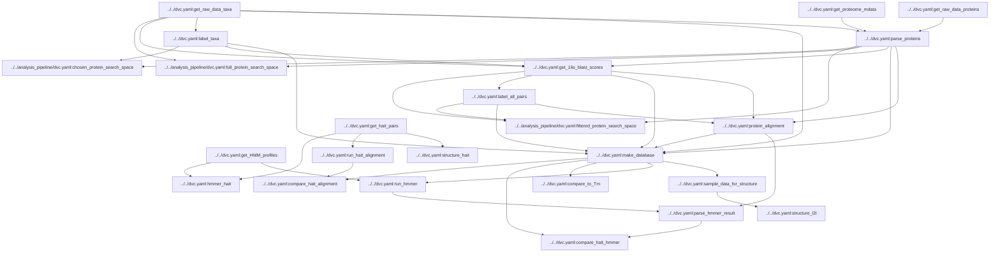

# Script components
Scripts are executed to track the project from raw data to trained model. This docuemnt details the DVC tracked execution
Each DVC stage is associated with a script

## Data ingestion
1. `s0.0_get_raw_data_taxa.py`  
    Pull most recent NCBI 16s r RNA sequences, and OGT records from Enqvist 
    - _Params_: `min_16s_len`, `max_16s_len` number of nucleotides required to keep and organism
    - _Outputs_: `data/taxa.parquet`, columns include OGT, 16s sequence, taxid
    - _Metrics_: `n_taxa` total number of labeled organisms, `taxa_pulled_date` when the data was retireved
2. `s0.1_get_raw_data_proteins.py`
    Retrieve single cell uniprot. Uses FTP to download very large uniprot files    
    - _Inputs_: `data/taxa.parquet`  
    - _Outputs_: `data/taxa/uniprot/uniprot_pulled_timestamp` indicates when files were pulled
    - _Metrics_: `taxa_pulled_date` when data was retrieved
    - _Untracked Outputs_: The script produces `*.xml.gz` files that are untracked because they take so long to download. DVC ignores them, subsequent calls to the script skip downloading files already present. 
3. `s0.2_get_proteome_mdata.py`  
    Get metadata for UniProt proteomes. Selects one "best" proteome per organism. 
    - _Outputs_: `data/uniprot/proteome_metadata.csv`  
4. `s0.3_parse_proteins.py`  
    Extract minimal protein data and store in efficient file format. Skip proteins that we dont have OGT for or are from redundant proteomes 
    - _Params_: `max_prot_per_file` size of parquet files
    - _Inputs_: `data/taxa/uniprot/uniprot_pulled_timestamp`, `data/taxa.parquet` 
    - _Outputs_: `data/proteins`, contains proteins in chunked files of the form `*.parquet`. Columns include protein sequence, database identifiers, and associated taxa IDs, `./data/metrics/s0.3_protein_per_data_distr.csv` table of number of proteins per taxa
    - _Metrics_: `n_proteins` total protein count, `percent_prot_w_struc` fraction of proteins with PDB or alphafold id

## Data pairing
5. `s1.0_label_taxa.py`
    Assign booleans for taxa as thermophile
    - _Params_: `ogt_threshold` binary thermophile threshold
    - _Inputs_: `data/taxa.parquet`
    - _Outputs_: `data/taxa_thermophile_labels.parquet`
    - _Metrics_: `n_meso`, `n_thermo`
6. `s1.1_get_16s_blast_scores.py`  
    Compute pairwise BLAST pairings of meso vs therma 16s rRNA sequences.   
    - _Params_: `16s_blast_parameters` (there are a number), `blast_metrics`
    - _Inputs_: `data/taxa*.parquet`, `./data/metrics/s0.3_protein_per_data_distr.csv` (used to skip alignment if taxa has no proteins)
    - _Outputs_: `data/taxa_pairs/alignment/*.parquet` table of id and BLAST scores. 
7. `s1.2_label_all_pairs.py`  
    Create a list of taxa pairs that meet a minumum 16s rRNA BLAST score.  
    - _Params_: `blast_metric_thresholds` defines thresholds on 16s blast metrics to consider a pair  
    - _Inputs_: `data/taxa_pairs/alignment/*.parquet`  
    - _Outputs_: `data/taxa_pairs/pair_labels/*.parquet` 1:1 index mapping to data/taxa_pairs/alignment/*.parquet of boolean labels of whether that taxa are a pair
    - _Metrics_: `num_taxa_pairs_conservative` number of pairs that passed thresholds. Only this number will we blastp, `taxa_pair_found_ratio` fraction of pairs with metrics eg n_taxa_pairs/(n_therm\*n_meso) that will be searched
    for protein paris
8. `s1.3_protein_alignment.py`
    Runs a massive parallel cluster to align protein pairs among taxa pairs using DIAMOND.
    - _Params_: `dask_cluster_class` class for cluster in dask_jobqueue, `max_protein_length`, `method` local aligner type, `n_jobs` parallel workers, each doing a taxa pair at a time, `method_X_params` where X is eg. "blast" params given to aligner, `blast_metrics` alignment metrics to record.
    - _Inputs_: `data/taxa_pairs/alignment/*.parquet`, `data/taxa_pairs/pair_labels/*.parquet`, `./data/proteins`
    - _Outputs_: `data/protein_pairs/*.parquet`, each file is alignment for a taxa pair with protein ids and metrics
    - _Metrics_: `protein_align_X`, where X is "emissions", "hits", "time", "return". The resources and used and return on investment of protein alignment.
9. `s1.4_make_database.py`
    Collect processed data files into a relational duckdb database.
    - _Inputs_: `data/taxa.parquet`, `data/taxa_thermophile_labels.parquet`, `data/protein_pairs/*.parquet`, `data/proteins/*.parquet`, `data/uniprot/proteome_metadata.csv`
    - _Outputs_: `data/database.ddb`

## Data validation
10. `s2.1_get_hait_pairs.py`
    Parse the protein pairs from Hait et al's excel files, query the PDB ids to get sequences.
    - _Outputs_: `data/validation/hait_pairs.csv`
11. `s2.2_compare_to_Tm.py`
    Compare melting temperatures from FireProtDB and Meltome Atlas to OGTs in the dataset.
    - _Inputs_: `data/database.ddb`
    - _Metrics_: `Tm_OGT_spearman_p`, `Tm_OGT_spearman_r` Spearman R and null probability of relationship between OGT from our data and melting temperature from 3rd party dataset
12. `s2.3_run_hait_alignment.py`
    Compute the alignment metrics for hait pairs using identical parameters as
    the alignment metrics for the full dataset.
    - _Params_: `method` local aligner type, `method_X_params` where X is eg. "blast" params given to aligner, `blast_metrics` alignment metrics to record.
    - _Inputs_: `data/validation/hait_pairs.csv`
    - _Outputs_: `data/validation/hait_aligned_scores.csv`
13. `s2.4_compare_hait_alignment.py`
    Compare metrics for BLAST alignments of Hait pairs to our dataset, and make some plots.
    - _Inputs_: `data/validation/hait_aligned_scores.csv`, `data/database.ddb`
    - _Outputs_: `data/validation/hait_alignment/*.png` Distribution comparison of alignment metrics, and size of your dataset if we were to use Hait scores as a filter.
14. `s2.5_get_HMM_profiles.py`
    Download Pfam HMMs.
    - _Outputs_: `./data/validation/hmmer/Pfam-A.hmm`
    - _Metrics_: `HMM_pulled_date` date of Pfam aquisition
15. `s2.6_hmmer_hait.py`
    Run Pfam against proteins in Hait pairs, compute Jaccard of annotations.
    - _Params_: `e_value` Maximum e-value for hmmer to report an annotation, `njobs` cores for parallel
    - _Inputs_: `data/validation/hait_pairs.csv`, `./data/validation/hmmer/Pfam-A.hmm`
    - _Outputs_: `data/validation/hait_scores.csv`
    - _Metrics_: `mean_jaccard` Mean jaccard score of annotations over Hait pairs, `fraction_found` Fraction of proteins with at least one Pfam annotation
16. `s2.7_run_hmmer.py`
    Scan Pfam against all proteins on our database that are in protein pairs.
    - _Params_: `e_value` Maximum e-value for hmmer to report an annotation, `njobs` cores for parallel, `scan` boolean to hmmscan or hmmsearch, `prefetch` whether to prefetch HMMs into memory or leave as file iterator, `chunk_size` size of protein chunks to run and save to file at one time.
    - _Inputs_: `data/database.ddb`, `./data/validation/hmmer/Pfam-A.hmm`
    - _Outputs_: `data/validation/hmmer_putputs/*.parquet` Pfam annotations for each protein
    - _Metrics_: `n_proteins_in_pairs` number of proteins in pairs, `n_proteins_labeled` number of proteins with at least one Pfam annotation.
17. `s2.8_parse_hmmer_result.py`
    Parse hmmer results into a table of protein pairs and their Jaccard scores of annotations
    - _Inputs_: `data/validation/hmmer_outputs/*.parquet`
    - _Outputs_: `data/validation/hmmer_labels/*.parquet`
    - _Metrics_: `mean_jaccard` Mean jaccard score of annotations over protein pairs, `fraction_found` Fraction of proteins with at least one Pfam annotation
18. `s2.9_compare_hait_hmmer.py`
    Compare Pfam annotations of Hait pairs to our dataset, and make some plots.
    - _Inputs_: `data/validation/hmmer_labels/*.parquet`, `data/database.ddb`
    - _Outputs_: `data/validation/hmmer/compare_jaccard_hist.png` Distribution comparison of alignment Jaccard scores for Hait pairs and our pairs. 
    - _Metrics_: `t_pvalue_base` p-value of t-test of Jaccard scores between Hait and our pairs, `t_pvalue_95` p-value of t-test of Jaccard scores between Hait and our pairs with > 95% blast coverage
19. `s2.10_sample_data_for_structure.py`
    Sample some protein pairs to conduct structural alignment on, uniform over BLAST coverage.
    - _Params_: `sample_size` number of protein pairs to sample, `metrics` list of queries to make from pairs table to sample pairs uniformly over
    - _Inputs_: `data/database.ddb`
    - _Outputs_: `data/validation/structure/sample_l2t_data.csv`
20. `s2.11_structure_hait.py`
    Run FATCAT structural alignment for Hait pairs by getting PDB structures.
    - _Inputs_: `data/validation/hait_pairs.csv`
    - _Outputs_: `data/validation/structure/hait_fatcat.csv`
21. `s2.12_structure_l2t.py`
    Run FATCAT structural alignment for L2T pairs by getting PDB or AlphaFold structures.
    - _Inputs_: `data/validation/structure/sample_l2t_data.csv`
    - _Outputs_: `data/validation/structure/l2t_sample_fatcat.csv`
