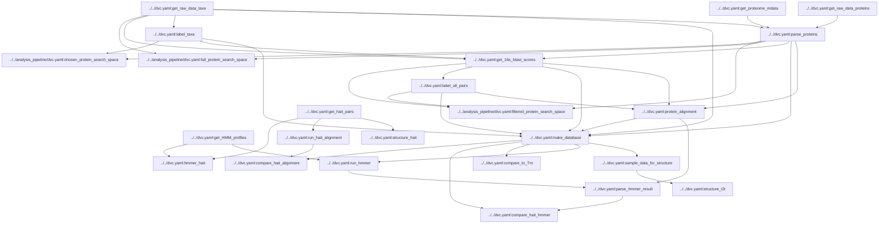

# Executables within data version controled pipeline

Script labeling is of the format `s.<Script Number>_<Script Name>`

## Pipeline Directory

| Script | Function |
| ------ | -------- |
| s0.0_get_raw_data_taxa.py | Pull most recent NCBI 16s r RNA sequences, and OGT records from Enqvist |
| s0.1_get_raw_data_proteins.py | Download bacterial and archaeal UniProtKB proteins. |
| s0.2_get_proteome_mdata.py | Get metadata for UniProt proteomes and select one "best" proteome per organism. |
| s0.3_parse_proteins.py | Extract minimal protein data, store in an efficient file format, and skip proteins that don't have OGT or are from redundant proteomes. |
| s1.0_label_taxa.py | Assign booleans for taxa as thermophiles based on a specified threshold. |
| s1.1_get_16s_blast_scores.py | Compute pairwise BLAST pairings of mesophilic vs thermophilic 16s rRNA sequences. |
| s1.2_label_all_pairs.py | Create a list of taxa pairs that meet a minimum 16s rRNA BLAST score. |
| s1.3_protein_alignment.py | Run a parallel cluster to align protein pairs among taxa pairs using DIAMOND. |
| s1.4_make_database.py | Collect processed data files into a relational duckdb database. |
| s2.1_get_hait_pairs.py | Parse the protein pairs from Hait et al.'s excel files and query the PDB IDs to get sequences. |
| s2.2_compare_to_Tm.py | Compare melting temperatures from FireProtDB and Meltome Atlas to OGTs in the dataset. |
| s2.3_run_hait_alignment.py | Compute alignment metrics for Hait pairs using identical parameters as the full dataset. |
| s2.4_compare_hait_alignment.py | Compare metrics for BLAST alignments of Hait pairs to the dataset, and make plots. |
| s2.5_get_HMM_profiles.py | Download Pfam HMMs. |
| s2.6_hmmer_hait.py | Run Pfam against proteins in Hait pairs and compute Jaccard scores of annotations. |
| s2.7_run_hmmer.py | Scan Pfam against all proteins in the database that are in protein pairs. |
| s2.8_parse_hmmer_result.py | Parse HMMER results into a table of protein pairs and their Jaccard scores of annotations. |
| s2.9_compare_hait_hmmer.py | Compare Pfam annotations of Hait pairs to the dataset, and make plots. |
| s2.10_sample_data_for_structure.py | Sample some protein pairs to conduct structural alignment on, uniformly over BLAST coverage. |
| s2.11_structure_hait.py | Run FATCAT structural alignment for Hait pairs by getting PDB structures. |
| s2.12_structure_l2t.py | Run FATCAT structural alignment for L2T pairs by getting PDB or AlphaFold structures. |

See the script [compspec]('./docs/compspec/pipeline_components.md') for more details.

## ENV variables
Ensure that the following are set in order access full functionality
- `ENV_EMAIL` - The email will be used to access NCBI FTP in `s0.0` and Bacdive in `s0.1`
- `NCBI_API_KEY` - API key from NCBI. Needed to get 16s sequences in `s0.0`. See [here](https://support.nlm.nih.gov/knowledgebase/article/KA-05317/en-us)
- `LOGLEVEL` (optional) - Specified logging level to run the package. eg 'INFO' or 'DEBUG'
- `FATCAT_EXEC` - Necessary for struvtura alignment steps of validation, `s2.11` and `s2.12`

## Notes
### s0.1

Extremely long runtime due to throttling by uniprot. Script does not actually DVC track the downloaded
files such that they can be skipped of the script is restarted. Thus, DVC cannot automatically determine
if this stage needs rerun - the files must be removed and the stage force ran to download newer version
of UniProt

## s0.3

Primary function of this script is twofold:
1. Vastly reduce the data size, keeping only primary sequence, database IDs eg alphafold and PDB, taxa ID, and proteome ID
2. Remove proteins that are unlabeled or redundant. If a protein belongs to an organism without OGT, it is skipped. If a protein is associated with a proteome but it is not the representative proteome selected for the organism, is it skipped.